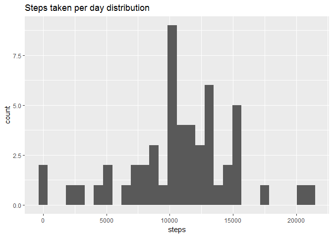
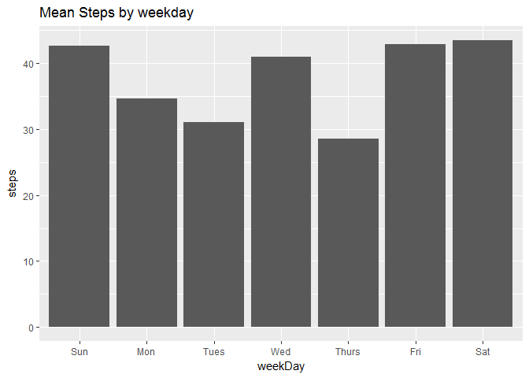
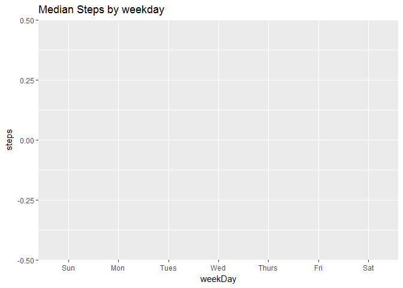
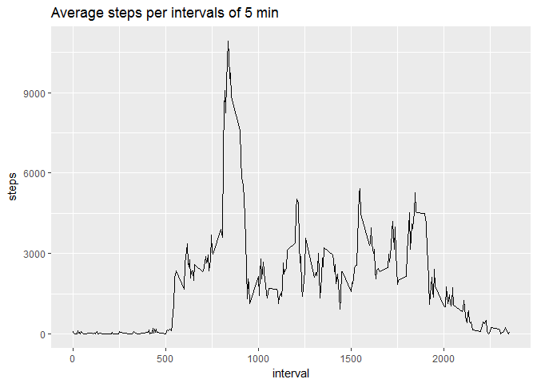
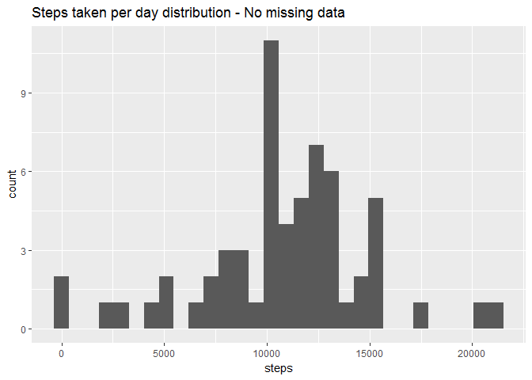
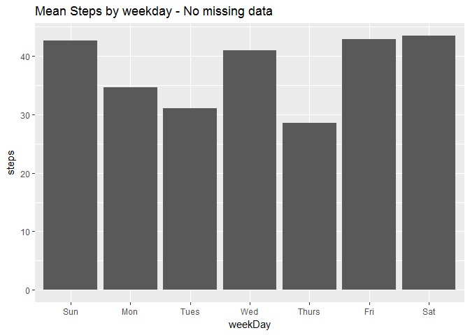
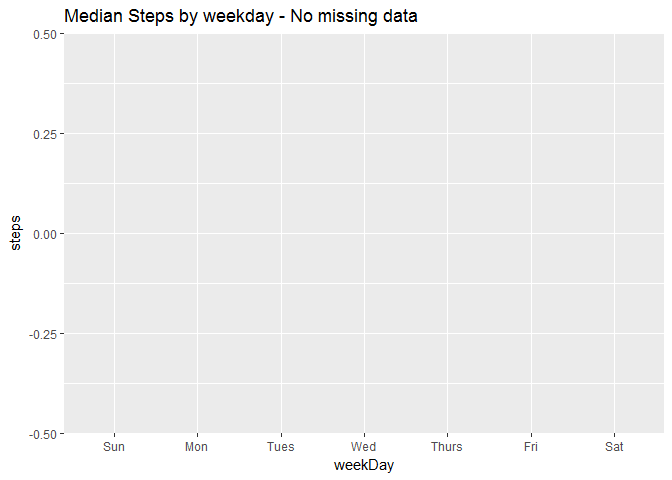
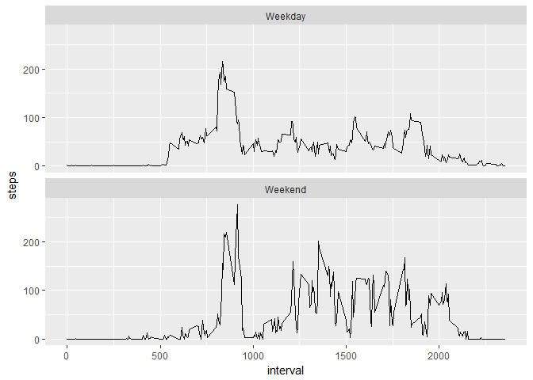

# Reproducible Research: Peer Assessment 1


## Loading and preprocessing the data

###First load all necessary libraries

```r
library(data.table)
library(lubridate)
```

```
## 
## Attaching package: 'lubridate'
```

```
## The following objects are masked from 'package:data.table':
## 
##     hour, isoweek, mday, minute, month, quarter, second, wday,
##     week, yday, year
```

```
## The following object is masked from 'package:base':
## 
##     date
```

```r
library(ggplot2)
library(RColorBrewer)
library(knitr)
```

```
## Warning: package 'knitr' was built under R version 3.3.3
```

###loading and preprocessing data

```r
setwd("C:/Users/Rafael/Documents/GitHub/RepData_PeerAssessment1")
unzip("activity.zip")
pa1 <- fread("activity.csv")
pa1[,date := ymd(date)]
```

```
##        steps       date interval
##     1:    NA 2012-10-01        0
##     2:    NA 2012-10-01        5
##     3:    NA 2012-10-01       10
##     4:    NA 2012-10-01       15
##     5:    NA 2012-10-01       20
##    ---                          
## 17564:    NA 2012-11-30     2335
## 17565:    NA 2012-11-30     2340
## 17566:    NA 2012-11-30     2345
## 17567:    NA 2012-11-30     2350
## 17568:    NA 2012-11-30     2355
```


## What is mean total number of steps taken per day?
### What is the distribution of total number of steps taken per day?

```r
stepsDay <- pa1[,.(steps = sum(steps)),by=date]
ggplot(data = stepsDay, aes(steps)) + 
    geom_histogram() +
    labs(title = "Steps taken per day distribution")
```

```
## `stat_bin()` using `bins = 30`. Pick better value with `binwidth`.
```

```
## Warning: Removed 8 rows containing non-finite values (stat_bin).
```

<!-- -->

### What is the mean number of steps taken per weekday?

```r
pa1[,weekDay := wday(date, label = TRUE)]
```

```
##        steps       date interval weekDay
##     1:    NA 2012-10-01        0     Mon
##     2:    NA 2012-10-01        5     Mon
##     3:    NA 2012-10-01       10     Mon
##     4:    NA 2012-10-01       15     Mon
##     5:    NA 2012-10-01       20     Mon
##    ---                                  
## 17564:    NA 2012-11-30     2335     Fri
## 17565:    NA 2012-11-30     2340     Fri
## 17566:    NA 2012-11-30     2345     Fri
## 17567:    NA 2012-11-30     2350     Fri
## 17568:    NA 2012-11-30     2355     Fri
```

```r
meanSteps <- pa1[,.(steps = mean(steps, na.rm = TRUE)), by=weekDay][order(weekDay)]
ggplot(data = meanSteps, aes(weekDay,steps)) + 
    geom_col() +
    labs(title = "Mean Steps by weekday")
```

<!-- -->

### What is the median number of steps taken per weekday?

```r
medianSteps <- pa1[,.(steps = as.numeric(median(steps, na.rm = TRUE))), by=weekDay][order(weekDay)]
ggplot(data = medianSteps, aes(weekDay,steps)) + 
    geom_col() +
    labs(title = "Median Steps by weekday")
```

<!-- -->

```r
noSteps <- pa1[steps == 0, .N]
allSteps <- pa1[,.N]
```


Median has value equal 0 for every weekday because the data set has more 0 than actual value when looking grouped by day.
Total 0 value on data set is 11014
Total number of row on data set is 17568


## What is the average daily activity pattern?


```r
avgStepsIntervals <- pa1[,.(steps = sum(steps, na.rm = TRUE)),by=interval]
ggplot(data = avgStepsIntervals, aes(interval,steps)) + 
    geom_line() +
    labs(title = "Average steps per intervals of 5 min")
```

<!-- -->

```r
maxSteps <- avgStepsIntervals[,max(steps)]
maxInterval <- avgStepsIntervals[steps == maxSteps, interval]
maxTime <- today() + minutes(maxInterval)
```

The 5-minute interval that has the most steps on average had 10927 steps in the interval 835 that corresponds to 13h 55m of the day.


## Imputing missing values

### Calculating total number of missing values


```r
naSteps <- sum(!complete.cases(pa1))
```

1 - Total number of missing values 2304

### Filling missing values. Mean for that weekday in that 5 min interval.


```r
fullPa1 <- pa1[, index := .GRP, by = 1:nrow(pa1)]
fullPa1$steps <- sapply(fullPa1$index, function (x)
    ifelse(is.na(fullPa1$steps[fullPa1$index == x])
           , mean(fullPa1$steps[
               fullPa1$weekDay == fullPa1$weekDay[fullPa1$index == x] 
               & fullPa1$interval == fullPa1$interval[fullPa1$index == x]
               ], na.rm = TRUE)
           ,fullPa1$steps[fullPa1$index == x]
    )
)
```

### Histogram, mean and Median with filled missing values


```r
stepsDayFull <- fullPa1[,.(steps = sum(steps)),by=date]
ggplot(data = stepsDayFull, aes(steps)) + 
    geom_histogram() +
    labs(title = "Steps taken per day distribution - No missing data")
```

```
## `stat_bin()` using `bins = 30`. Pick better value with `binwidth`.
```

<!-- -->


```r
meanStepsFull <- fullPa1[,.(steps = mean(steps, na.rm = TRUE)), by=weekDay][order(weekDay)]
ggplot(data = meanStepsFull, aes(weekDay,steps)) + 
    geom_col() +
    labs(title = "Mean Steps by weekday - No missing data")
```

<!-- -->


```r
medianStepsFull <- fullPa1[,.(steps = median(steps, na.rm = TRUE)), by=weekDay][order(weekDay)]
ggplot(data = medianStepsFull, aes(weekDay,steps)) + 
    geom_col() +
    labs(title = "Median Steps by weekday - No missing data")
```

<!-- -->

```r
noStepsFull <- fullPa1[steps == 0, .N]
allStepsFull <- fullPa1[,.N]
```
Median has value equal 0 for every weekday because the data set has more 0 than actual value when looking grouped by day.
Total 0 value on data set is 11689
Total number of row on data set is 17568


### What is the impact of imputing missing data on the estimates of the total daily number of steps?

####Steps by day

```r
stepsComp <- stepsDay[stepsDayFull, on = "date"]
setnames(stepsComp, c("date", "steps with NA", "steps filled NA"))
stepsComp[,Difference := `steps filled NA`-ifelse(is.na(`steps with NA`),0,`steps with NA`)]
```

```
##           date steps with NA steps filled NA Difference
##  1: 2012-10-01            NA        9974.857   9974.857
##  2: 2012-10-02           126         126.000      0.000
##  3: 2012-10-03         11352       11352.000      0.000
##  4: 2012-10-04         12116       12116.000      0.000
##  5: 2012-10-05         13294       13294.000      0.000
##  6: 2012-10-06         15420       15420.000      0.000
##  7: 2012-10-07         11015       11015.000      0.000
##  8: 2012-10-08            NA        9974.857   9974.857
##  9: 2012-10-09         12811       12811.000      0.000
## 10: 2012-10-10          9900        9900.000      0.000
## 11: 2012-10-11         10304       10304.000      0.000
## 12: 2012-10-12         17382       17382.000      0.000
## 13: 2012-10-13         12426       12426.000      0.000
## 14: 2012-10-14         15098       15098.000      0.000
## 15: 2012-10-15         10139       10139.000      0.000
## 16: 2012-10-16         15084       15084.000      0.000
## 17: 2012-10-17         13452       13452.000      0.000
## 18: 2012-10-18         10056       10056.000      0.000
## 19: 2012-10-19         11829       11829.000      0.000
## 20: 2012-10-20         10395       10395.000      0.000
## 21: 2012-10-21          8821        8821.000      0.000
## 22: 2012-10-22         13460       13460.000      0.000
## 23: 2012-10-23          8918        8918.000      0.000
## 24: 2012-10-24          8355        8355.000      0.000
## 25: 2012-10-25          2492        2492.000      0.000
## 26: 2012-10-26          6778        6778.000      0.000
## 27: 2012-10-27         10119       10119.000      0.000
## 28: 2012-10-28         11458       11458.000      0.000
## 29: 2012-10-29          5018        5018.000      0.000
## 30: 2012-10-30          9819        9819.000      0.000
## 31: 2012-10-31         15414       15414.000      0.000
## 32: 2012-11-01            NA        8212.750   8212.750
## 33: 2012-11-02         10600       10600.000      0.000
## 34: 2012-11-03         10571       10571.000      0.000
## 35: 2012-11-04            NA       12277.714  12277.714
## 36: 2012-11-05         10439       10439.000      0.000
## 37: 2012-11-06          8334        8334.000      0.000
## 38: 2012-11-07         12883       12883.000      0.000
## 39: 2012-11-08          3219        3219.000      0.000
## 40: 2012-11-09            NA       12359.714  12359.714
## 41: 2012-11-10            NA       12535.429  12535.429
## 42: 2012-11-11         12608       12608.000      0.000
## 43: 2012-11-12         10765       10765.000      0.000
## 44: 2012-11-13          7336        7336.000      0.000
## 45: 2012-11-14            NA       11790.750  11790.750
## 46: 2012-11-15            41          41.000      0.000
## 47: 2012-11-16          5441        5441.000      0.000
## 48: 2012-11-17         14339       14339.000      0.000
## 49: 2012-11-18         15110       15110.000      0.000
## 50: 2012-11-19          8841        8841.000      0.000
## 51: 2012-11-20          4472        4472.000      0.000
## 52: 2012-11-21         12787       12787.000      0.000
## 53: 2012-11-22         20427       20427.000      0.000
## 54: 2012-11-23         21194       21194.000      0.000
## 55: 2012-11-24         14478       14478.000      0.000
## 56: 2012-11-25         11834       11834.000      0.000
## 57: 2012-11-26         11162       11162.000      0.000
## 58: 2012-11-27         13646       13646.000      0.000
## 59: 2012-11-28         10183       10183.000      0.000
## 60: 2012-11-29          7047        7047.000      0.000
## 61: 2012-11-30            NA       12359.714  12359.714
##           date steps with NA steps filled NA Difference
```

```r
stepsCompDiff <- as.integer(round(stepsComp[,sum(Difference)],0))
```

The total difference from total steps taken from data with NA against NA filled is 89486 steps. 


####Mean steps taken per weekday

```r
meanComp <- meanSteps[meanStepsFull, on = "weekDay"]
setnames(meanComp, c("weekDay", "steps with NA", "steps filled NA"))
meanComp[,Difference := `steps with NA`-`steps filled NA`]
```

```
##    weekDay steps with NA steps filled NA Difference
## 1:     Sun      42.63095        42.63095          0
## 2:     Mon      34.63492        34.63492          0
## 3:    Tues      31.07485        31.07485          0
## 4:     Wed      40.94010        40.94010          0
## 5:   Thurs      28.51649        28.51649          0
## 6:     Fri      42.91567        42.91567          0
## 7:     Sat      43.52579        43.52579          0
```

```r
meanCompDiff <- meanComp[,sum(Difference)]
```

The total difference from mean steps taken by weekday from data with NA against NA filled is 0.
This means that data has no difference since it was filled with the mean of same dimension.

####Median steps taken per weekday

```r
medianComp <- medianSteps[medianStepsFull, on = "weekDay"]
setnames(medianComp, c("weekDay", "steps with NA", "steps filled NA"))
medianComp[,Difference := `steps with NA`-`steps filled NA`]
```

```
##    weekDay steps with NA steps filled NA Difference
## 1:     Sun             0               0          0
## 2:     Mon             0               0          0
## 3:    Tues             0               0          0
## 4:     Wed             0               0          0
## 5:   Thurs             0               0          0
## 6:     Fri             0               0          0
## 7:     Sat             0               0          0
```

```r
medianCompDiff <- medianComp[,sum(Difference)]
```

The total difference from median steps taken by weekday from data with NA against NA filled is 0.
This means that data has no difference since it was filled with the median of same dimension.


## Are there differences in activity patterns between weekdays and weekends?


```r
fullPa1[,typeOfDay := ifelse(wday(date) > 6, "Weekend", "Weekday")]
```

```
##           steps       date interval weekDay index typeOfDay
##     1: 1.428571 2012-10-01        0     Mon     1   Weekday
##     2: 0.000000 2012-10-01        5     Mon     2   Weekday
##     3: 0.000000 2012-10-01       10     Mon     3   Weekday
##     4: 0.000000 2012-10-01       15     Mon     4   Weekday
##     5: 0.000000 2012-10-01       20     Mon     5   Weekday
##    ---                                                     
## 17564: 0.000000 2012-11-30     2335     Fri 17564   Weekday
## 17565: 0.000000 2012-11-30     2340     Fri 17565   Weekday
## 17566: 0.000000 2012-11-30     2345     Fri 17566   Weekday
## 17567: 0.000000 2012-11-30     2350     Fri 17567   Weekday
## 17568: 1.142857 2012-11-30     2355     Fri 17568   Weekday
```

```r
fullPa1[,typeOfDay := as.factor(typeOfDay)]
```

```
##           steps       date interval weekDay index typeOfDay
##     1: 1.428571 2012-10-01        0     Mon     1   Weekday
##     2: 0.000000 2012-10-01        5     Mon     2   Weekday
##     3: 0.000000 2012-10-01       10     Mon     3   Weekday
##     4: 0.000000 2012-10-01       15     Mon     4   Weekday
##     5: 0.000000 2012-10-01       20     Mon     5   Weekday
##    ---                                                     
## 17564: 0.000000 2012-11-30     2335     Fri 17564   Weekday
## 17565: 0.000000 2012-11-30     2340     Fri 17565   Weekday
## 17566: 0.000000 2012-11-30     2345     Fri 17566   Weekday
## 17567: 0.000000 2012-11-30     2350     Fri 17567   Weekday
## 17568: 1.142857 2012-11-30     2355     Fri 17568   Weekday
```

```r
table(fullPa1[,typeOfDay])
```

```
## 
## Weekday Weekend 
##   15264    2304
```


```r
meanFullPa1 <- fullPa1[, .(steps = mean(steps)), by=.(interval, typeOfDay)]
ggplot(data = meanFullPa1, aes(interval, steps))+
    geom_line()+
    facet_wrap(~typeOfDay, ncol=1)
```

<!-- -->
